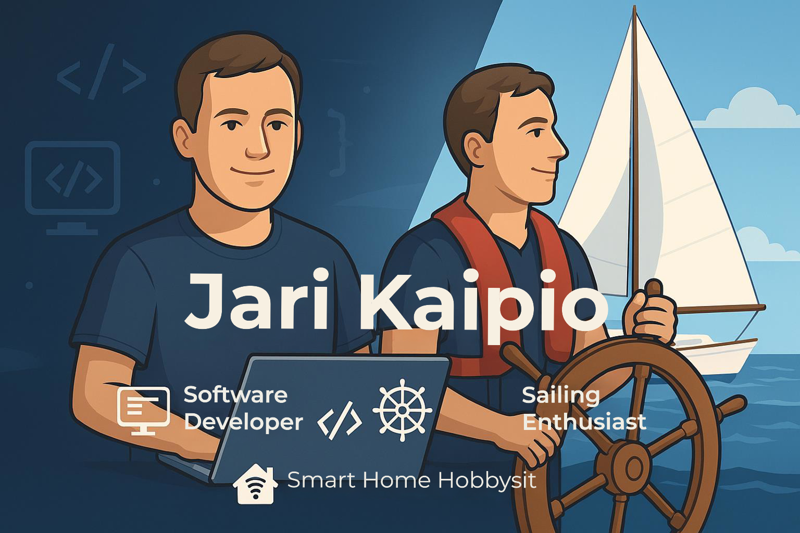

<!-- Banner -->
 | 🏠 Smart Home Hobbyist

---

## 👨‍💻 About Me
- 🌟 **25+ years** of experience in software development — both as a hobbyist and professional.
- 💡 Passionate about creating elegant, efficient solutions and exploring new technologies.
- 🏠 Love building **smart home automations** using [Home Assistant](https://www.homecoding, you’ll find me sailing and enjoying the freedom of the open water.

---

## 🔧 Tech Stack & Interests
- **Languages:** C#, Python, JavaScript, TypeScript
- **Frameworks & Tools:** .NET, Node.js, React, Docker
- **Special Interests:**  
  - Home Automation  
  - IoT Projects  
  - Cloud & Edge Computing  

---

## 🌊 Hobbies
- Sailing with my sailboat 🛥️
- Experimenting with smart home setups  
- Exploring new tech trends and open-source projects  

---

## 📊 GitHub Stats
✨ “Code is like the wind — you can’t see it, but you can feel its impact.”
